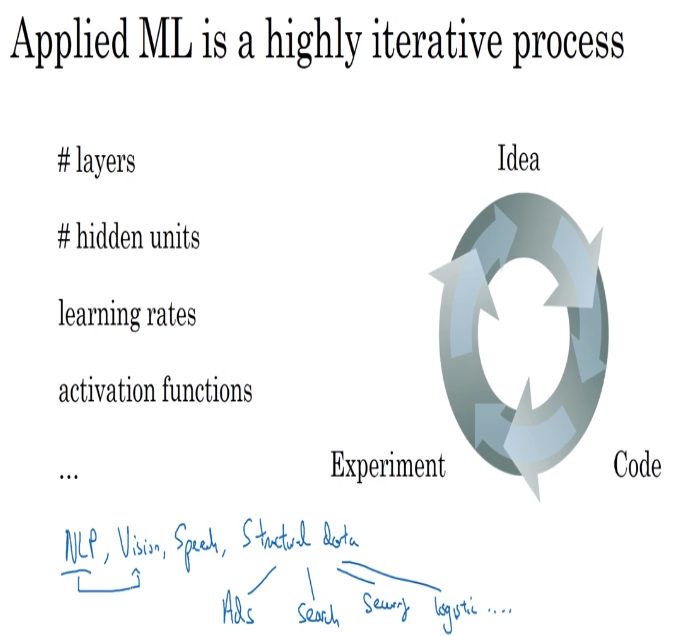
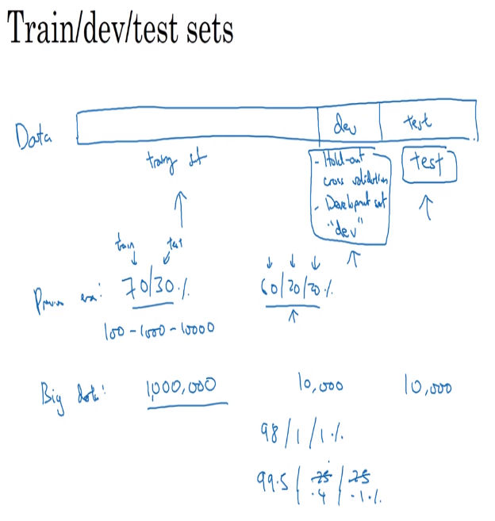
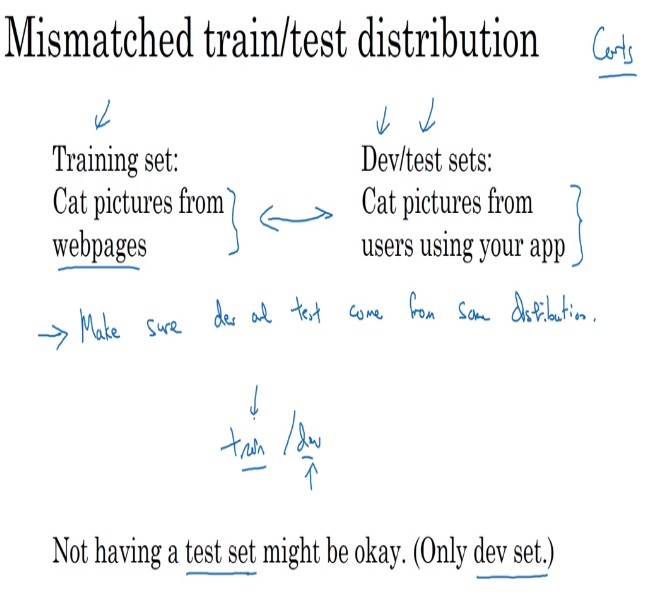

# 1 train dev test sets

- usually choosing the amount of layers or datasets is very difficult, so creating a neural network is an iterative process between ideas -> code -> experiment
- some of the attributes that are iterated are number of layers, number of hidden units, learning rates, activation functions between others

## trends in data selection

- previously, in data centered developments, it was accepted that you had 70 / 30 % division of the data to test and train the models, or maybe 60 / 20 / 20 % (train, dev, test)
- now with big data, for instance a million examples, you could simply select 10 thousand entries to develop and 10 thousand for test, so the percentages are 98 / 1 / 1 % for each data set

## trends on mismatched train test distributions

- there are some datasets that could come from different sources (for instances you could have a set of great quality images of cats, but lets say users upload images with very bad quality, so the dataset gets damaged)
- we should make sure that all the sets come from the same distribution (the good data or the bad data)

