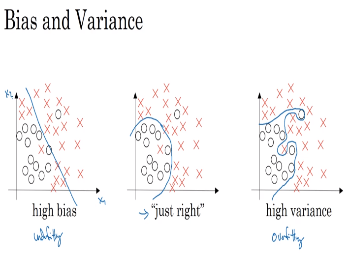

# 02 bias and variances

## trends of variance tradeoff

- there is a chance that when calculatin the error on the network results we find problems of underfitting or overfitting the models according to the available data.
- in the image we can see the phenomena for a set of data  where the most extreme cases are either included or excluded in the datasets.

### example

- if you have 1% error in the train set error and 11% error in the dev set error, it means you could be `overfitting` (high variance) the set, we are not generalizing correctly.
- if you have 15% error in the train set and the dev set error of 16% (assuming that humans could tell with 0% error if images are dogs or cats) this one should be that we have high bias in these data sets
- if we have 15% and 30% we could have high bias and high variance which is the worst possible result

- we are usualy assuming that the evaluations of the human assesment is near nil

## high bias and high variance

- the algorithm is fitting the data in a weird way, something like this.

