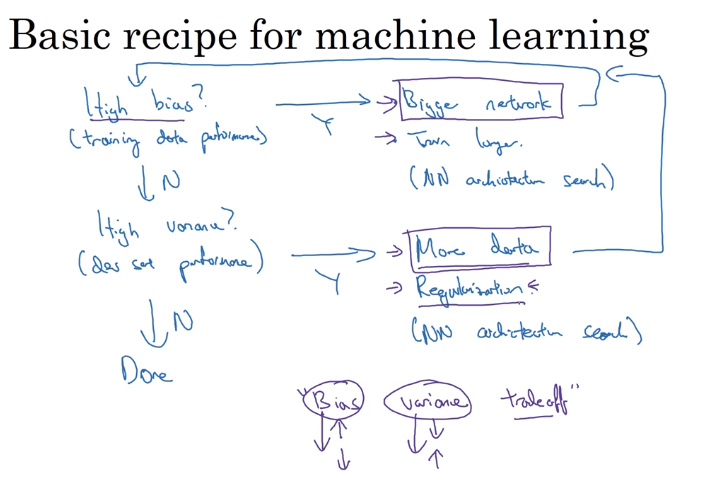

# 03 basic recipe for machine learning

## does your algorithm have high bias (training data performance) issues?

- then try a bigger network
- or use a larger train dataset
- change the NN architecture

## does your algorithm have high variance issues?

- use more data
- try regularization
- change the NN architecture

### bias variance trade off

- doing changes that improve bias and affect variance, or viceversa, is not really a good thing to do anymore, some teams would go for doing a trade off between them, but that is an old practice.

