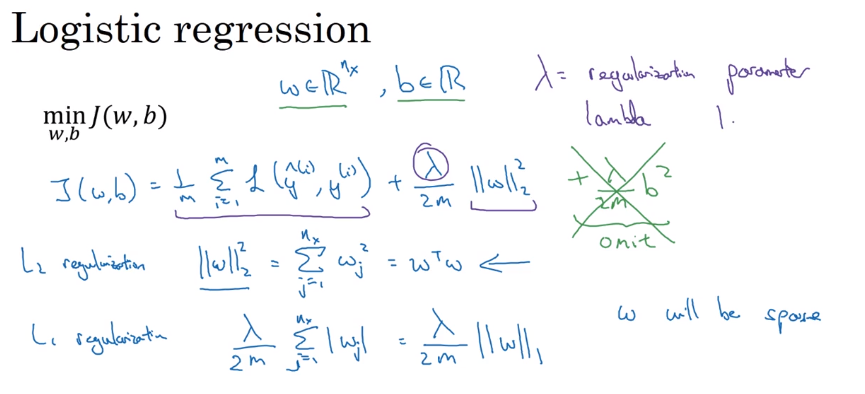
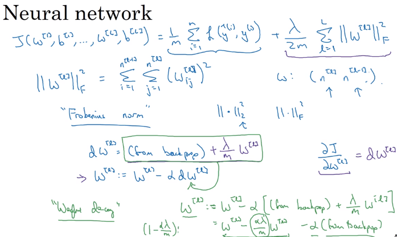

# 04 regularization

- this technique is used to avoid overfitting the data to the model

## regularization in logistic regression

- in logistic regression we add a lambd parameter (without a because lambda is a reserved word in python)
- this parameter is included as the norm of weights squared to the cost function

## regularization in neural networks

