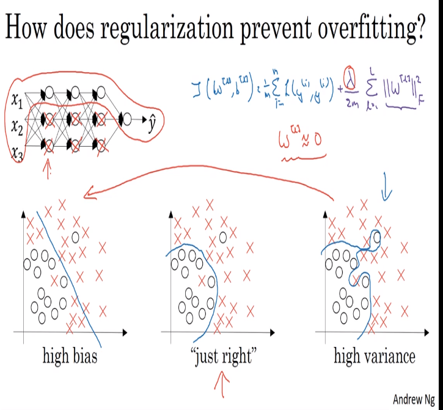
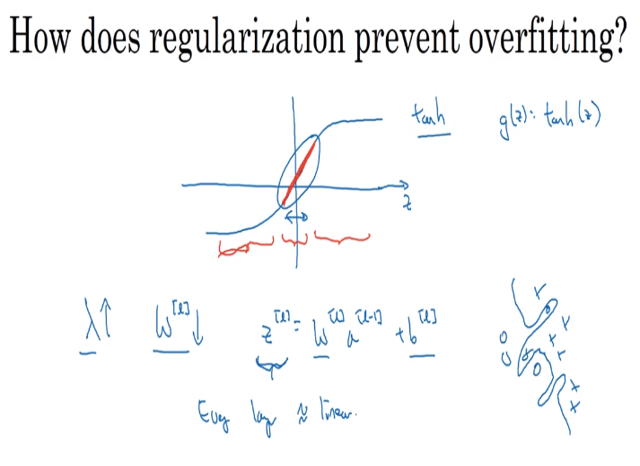

# how does regularization prevent overfitting

- when we set weights very close to nil, the neural network starts looking similar to a logistic regression, which has individual weights in each hidden layer

- when using tanh activation functions, the slope of the curve is adjusted so that lambda is big when weight is low.
- in some cases, the curve will have similar values as a linear function (derivatives change very little)

