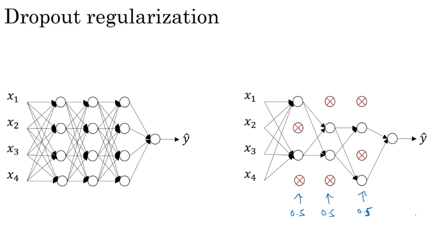
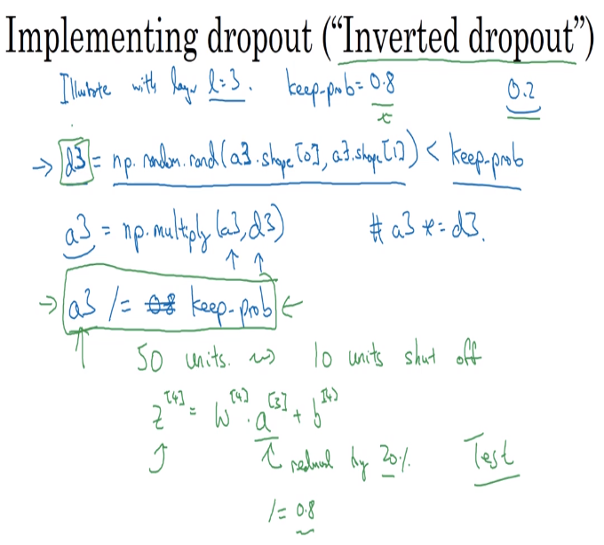
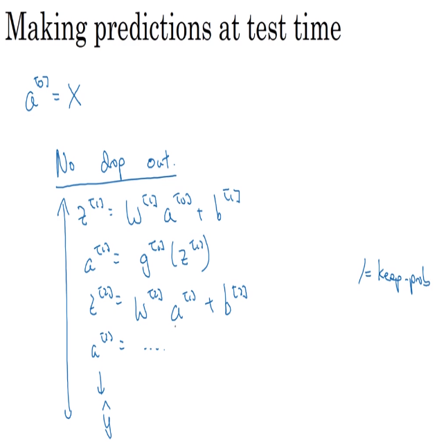

# dropout

- with dropout, we are going through each of the hidden layers and calculating the probability to eliminate it (toss a coin).

## implementing dropout

- illustrate with 3 layers
- dropout_three = d3 = np.random.rand(a3.shape[0], a3.shape[1]) < keep_probability
- where our keep probability is a probability we choose so we keep the value or not

## making predictions at test time

- the inverted dropout, even when applying the probability division to the values, helps keep the consistency of the model and does not affect overall results

